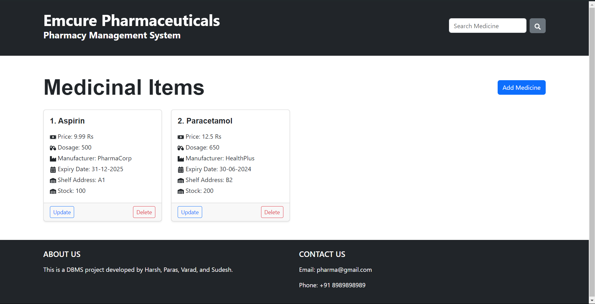

# Medicine Management System

A comprehensive web-based solution for managing medicine inventory in medical stores. This system provides CRUD operations for medicines and includes a search functionality to quickly find specific medications.

## Features

- Add, view, update, and delete medicines
- Search functionality for quick access to medicine information
- User-friendly interface for easy navigation
- Secure authentication system

## Technologies Used

- Backend: Spring Boot
- Frontend: React.js
- Database: MySQL
- API: RESTful

## Installation

### Prerequisites

- Java JDK 11 or higher
- Node.js and npm
- MySQL

### Backend Setup

1. Clone the repository:
2. Navigate to the backend directory:
3. Configure the MySQL database connection in `src/main/resources/application.properties`.
4. Run the Spring Boot application

### Frontend Setup

1. Navigate to the frontend directory:
2. Install dependencies:npm install
3. Start the React development server

## Usage

1. Access the application at (FrontEnd)`http://localhost:3000`
2. Access the application at (BackEnd)`http://localhost:8080`
3. Use the dashboard to manage medicines:
- Add new medicines
- View existing inventory
- Update medicine details
- Delete medicines
- Search for specific medicines

## Contact

For any queries or support, please contact:

- Project Maintainer: Harsh Doshi
- Email: doshiharsh2004@gmail.com
- GitHub: [@Harsh-D-2004](https://github.com/Harsh-D-2004)